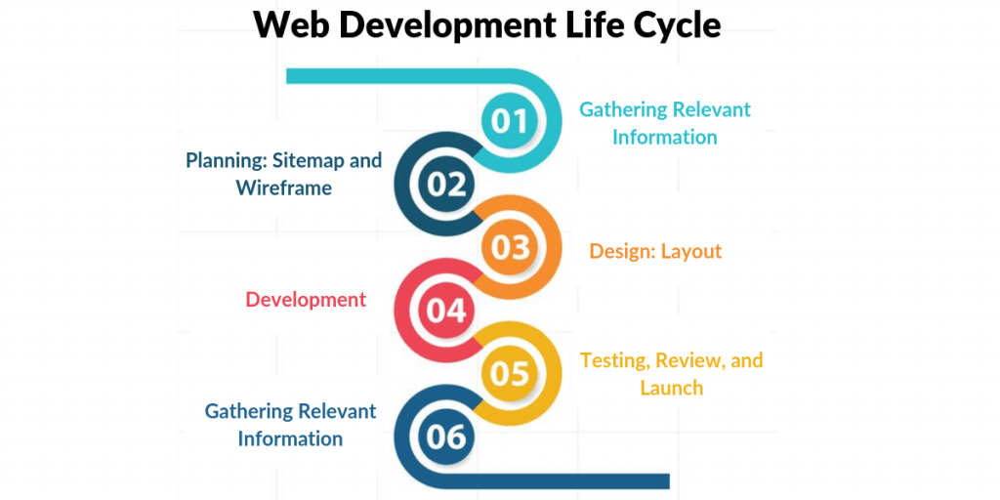
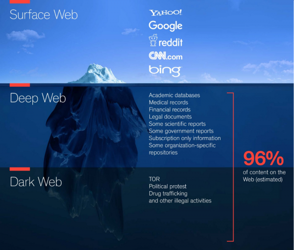
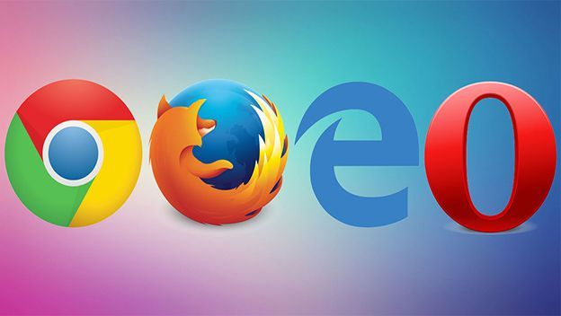
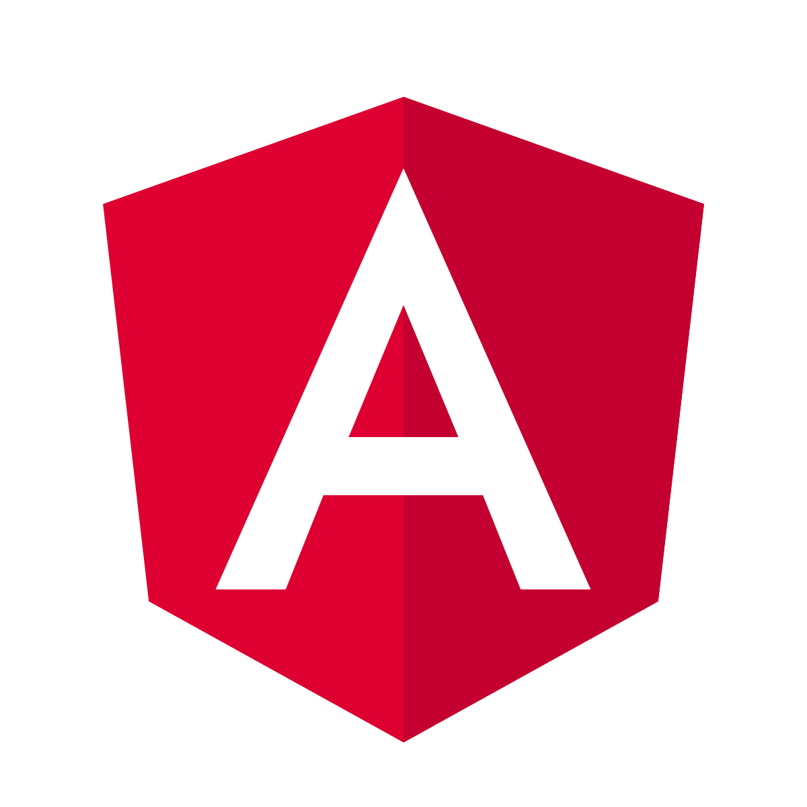
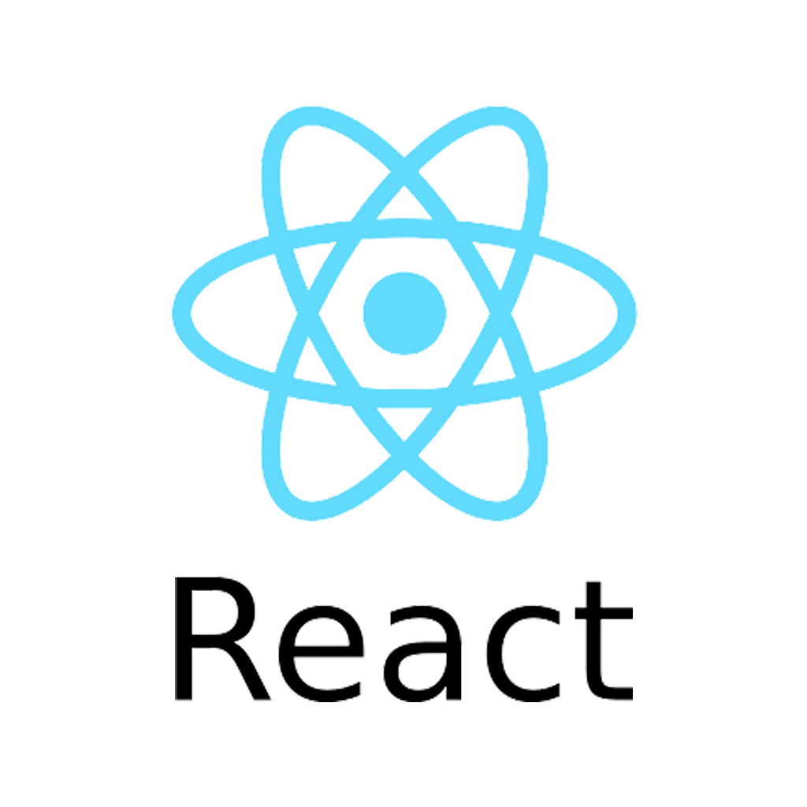
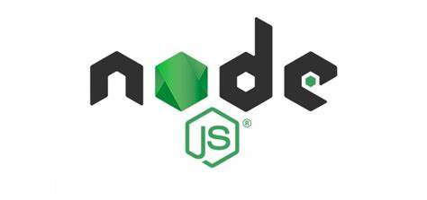
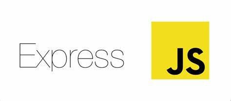
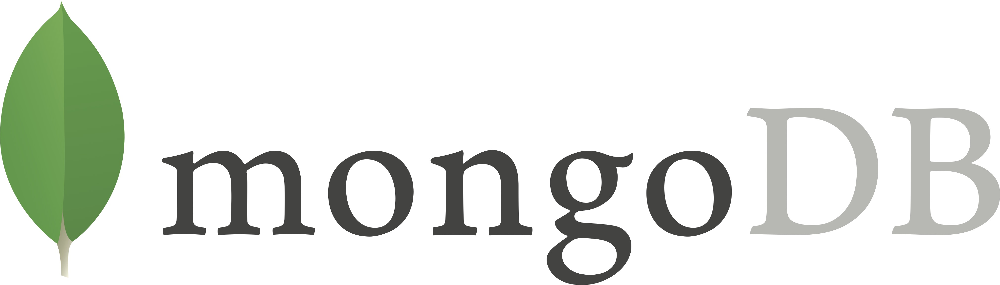
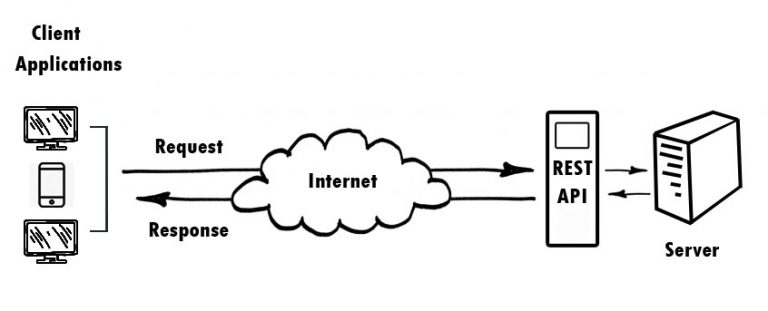
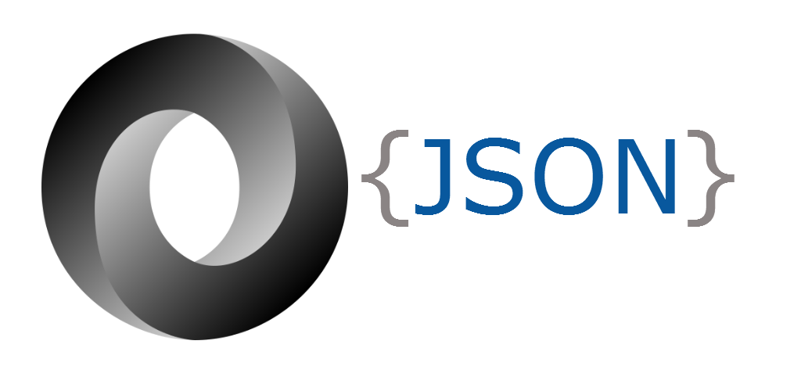

# Intro to Web Development 1

---

## Slide 1

# INTRODUCTION TO WEB DEVELOPMENT

- DAY 1
---

## Slide 2

# Why Full Stack Web Development?

- Full Stack Development is a software profession/stream where a developer deals with both the Frontend (client-side) and Backend (server-side) of a tech product.
- A Full Stack Developer is proficient in several technologies that help in developing a robust tech product, and thus play a major role in making decisions for the company.
- It is one of the high-demand jobs in the software industry.
---

## Slide 3

# What is the job of a Full Stack Developer?

- Full-stack developers develop both the front-end and the server-side of the application, deploy, debug and maintain their databases and servers.
- Being a Full Stack Web Developer, you will be at an edge as you make better technical decisions .
---

## Slide 4

# What skills are required to become a Full Stack Developer?

- HTML, CSS, UI & UX, JavaScript, etc.
- Server-side languages such as Java, Python, Node.js, etc.
- Frameworks Express, Spring Boot, Django, etc.
- Along with an understanding of System Design, Data Structures and Algorithms, Databases, and version control systems like Git.
---

## Slide 5

# Who Is full stack Developer?

- Full Stack Developer is an engineer who can work on different levels of an application stack.
- The term stack refers to the combination of components and tools that make up the application.
- The components could be in the front-end or the back-end of the system.
- The main objective of full stack engineer is to keep every part of the system running smoothly.
---

## Slide 6

# WEB DEVELOPMENT

- It is refer to the development of the Websites, building, creating and maintaining the websites.

---

## Slide 7

# Web development teams and roles

- Web Designer
- Front-End Developer
- Back-End Developer
- Full-Stack Developer
- Content Developer
- Webmaster
- Other stars
---

## Slide 8

# What is WEB?

- It refers to the websites or webpages or anything that work on the internet.

---

## Slide 9

# DEVELOPMENT

- Building the application from the scratch.
---

## Slide 10

# WEB APPLICATIONS

- Application program that is stored on a remote server.

---

## Slide 11

# WEB PAGES

- First created by Tim Berners Lee on August 6,1991
- What we seen in the web browser.
- Its an HTML document that contains html tags
- It can accessed through the browser by entering the URL address.
- It contains text, images, video etc.
---

## Slide 12

# WEB BROWSERS

- Application software for accessing website.
- It retrieves the information and displays the information over the desktop.
- Information is transferred using the Hypertext Transfer Protocol (HTTP)
- e.g.: Firefox, Chrome, edge etc

---

## Slide 13

# WHAT IS THE DIFFERENCE BETWEEN THE WEBPAGES AND THE WEBSITES?

- Website is the central location for containing more than one webpages.
---

## Slide 14

---

## Slide 15

# Modern Application Architecture

- Modern applications are developed to be installed on mobile devices or hosted on the web.
- System parts
- Back-End – Operating System (OS) – Firewall – Web server – Database (SQL or NoSQL) – Caches – Message Queuing software – Application
- Front-End – HTML – CSS – JavaScript
---

## Slide 16

# Modern Front-End frameworks

- We have seen the big shift in the web from HTML 4 to HTML5 which has built-in APIs to help you accomplish many tasks to built a richer web application.
- This has resulted in a variety of front-end MVC frameworks such as:
- AngularJS ….(Currently we are using Angular)
- React Js
---

## Slide 17

# Modern Development Frameworks

- The changing computing world has led to and been led by the fast growing world of web development frameworks such as:
- NodeJS
- Django
---

## Slide 18

# WEB DEVELOPMENT CAN BE CLASSIFIED INTO TWO WAYS

- FRONTEND(CLIENT SIDE)
- BACKEND(SERVER SIDE)
---

## Slide 19

---

## Slide 20

# 1.FRONTEND(CLIENT SIDE)

- What we seen on the screen.
- The part of the screen that users can interact directly.
- Provide the view of web application.
- Frontend Technologies - HTML, Angular, React
- e.g.: login page of Facebook.
---

## Slide 21

# HTML, CSS, JS and bootstrap

- HTML
- HYPERTEXT MARKUP LANGUAGE (Skelton of webpages)
- CSS
- CASCADING STYLE SHEET(Styling the web page)
- JS
- JAVASCRIPT(Dynamic behaviour)
- BOOTSTRAP
- (Advanced styling)
- know about bootstrap follow this link: https://getbootstrap.com/docs/5.0
---

## Slide 22

# Duties of frontend

- Providing the view of the frontend.
- Data send to the server.
---

## Slide 23

# BACKEND(SERVER SIDE)

- It is the part of the website that users cannot see.
- It is the portion of software that does not come in direct contact with the users.
- It is used to store and arrange data.
- Technologies -java, python, .net, Nodejs
---

## Slide 24

# Duties of backend

- Client request handle and process
- Request to Data base.
- Request send back to the client
---

## Slide 25

---

## Slide 26

# Angular

- Angular is an open-source, JavaScript framework written in TypeScript.
- Google maintains it, and its primary purpose is to develop single-page applications.
- Official site : https://angular.io

---

## Slide 27

# React

- React is a JavaScript library for building user interfaces.
- It is used to build single-page applications.
- It allows us to create reusable UI components
- React was released by Facebook in 2013, and they still use it today for many of their applications.
- https://reactjs.org

---

## Slide 28

# Nodejs

- It is a Runtime environment.
- It allows run JavaScript on the server.
- https://nodejs.org

---

## Slide 29

# EXPRESS

- It is a NodeJS framework.
- It provides us the tools that are required to build our app.
- Site: expressjs.com

---

## Slide 30

# FRAMEWORK

- It is prebuilt functions for the various purpose.
- Frameworks are typically associated with a specific programming language and are suited to different types of tasks.
---

## Slide 31

# DATA BASE

- It is mainly used in dealing with website information.
- Primary function of it deals with storing, updating, creating and deleting data.(CRUD)
- e.g.: Validate the email id and password existing or not.
- Technologies: MySQL, MONGODB etc
---

## Slide 32

# MONGODB

- MongoDB is a powerful, highly scalable, free and open-source NoSQL based database.
- Widely used across various web applications as the primary data store.

---

## Slide 33

# WHAT IS DATA

- Its a small unit of information which helps to manipulate the information in many ways.
- It can take many forms like: text, audio, video, image, gif etc.
---

## Slide 34

# WHAT IS METADATA

- Data about data
- It helps people understand the essential attributes of data, like its origin, time period, geographic coverage, etc.
- Meta data is always valuable
---

## Slide 35

# How to connect the client and server systems?

- This can achieved by using the API.

---

## Slide 36

# API (APPLICATION PROGRAMMING INTERFACE)

- It is a set of functions that allows applications to access data
- To simplify, an API delivers a user response to a system and sends the system’s response back to a user.
- This communication is done using a programming language called “JSON.”
- e.g.: act like waiter
---

## Slide 37

# JSON(JavaScript Object Notation)

- Data sharing on network using very faster methods - XML, JSON
- It is used to represent data on a server.
- It’s fairly easy to read by humans, and easy for machines/applications to understand.
- This is easy to understand as it’s outputted in key/value pairs.

---

## Slide 38

# PROTOCOLS

- It is a set of rules for sending data.
- A protocol is  a standard for enabling the connection, communication, and data transfer between two places on a network.
- e.g.: FTP,HTTP
---

## Slide 39

# HTTP - (Hypertext Transfer Protocol)

- It is for transmitting hypermedia documents, such as HTML.
- HTTP follows a client opening a connection to make a request, then waiting until it receives a response.
- Head - Confidential data
- Body - Data to share with the server.
---

## Slide 40

# The http methods for CRUD operations

- GET – Gathers information
- PUT –  Updates pieces of data
- POST – Creates the new data
- DELETE –Delete pieces of data
---

## Slide 41

# WHY WE USE CERTAIN SET OF TECHNOLOGY?

- All the technologies we used in MEAN is based on JavaScript.
- MEAN/MERN uses only JavaScript and therefore is the universal language of development.
- This can significantly reduce the cost and effort spent on coding since two separate teams won’t be required for the front-end and back-end separately.
---

## Slide 42

# Other Things

- Virtual Machines will help you set up a fresh development machine on which you can build the environment that you need for your project.
- Command Line Interface will give you the tools you need to interact with your development machine and environment directly or remotely, with or without a GUI. Software Package Managers will introduce you to the tools that will help you manage and set up the software in your development environment.
- Editors and IDEs will give you the ability to create and edit files in your development environment.
- DEVELOPER TOOL - are built directly into the browser. These are the tools that are browser dependent. Most of these tools are common among various browsers and do a range of things, from inspecting elements of a currently-loaded HTML, CSS, and -JavaScript. With developer tools, we can directly interact with the source code that is fetched into the client side of our system.
---

## Slide 43

# Thank You
