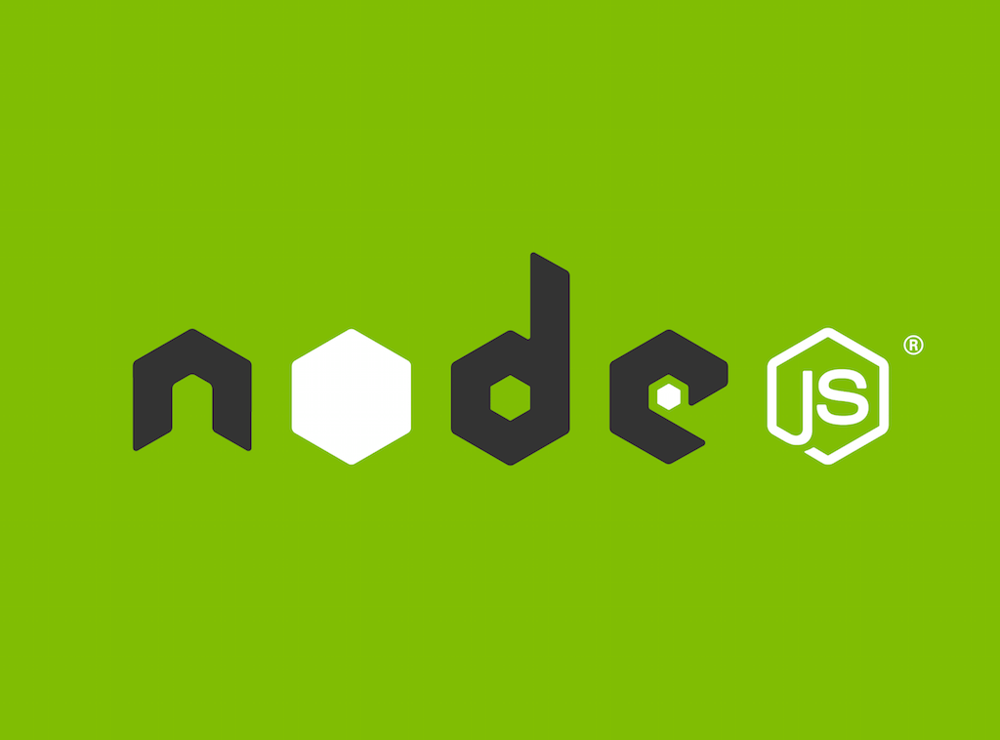
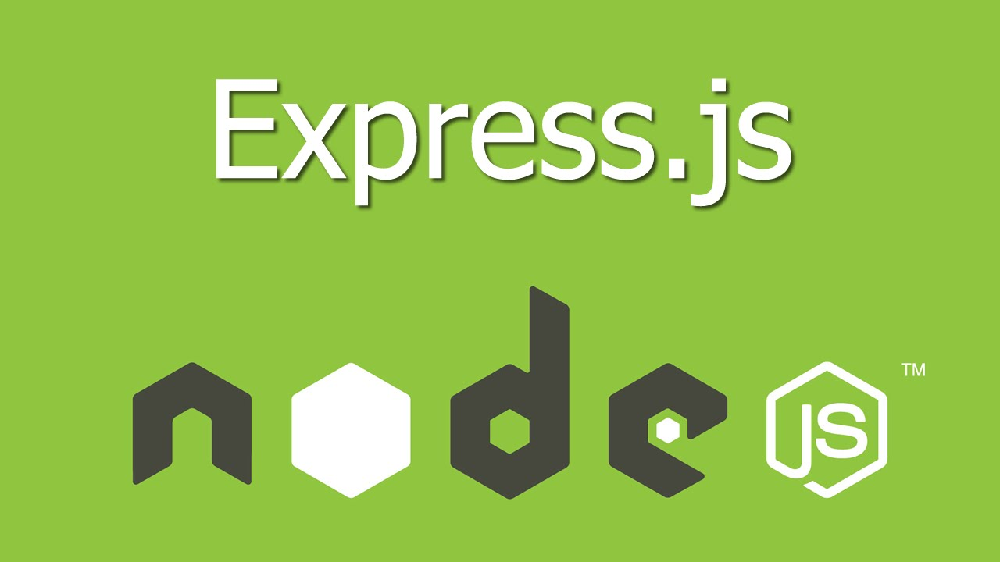
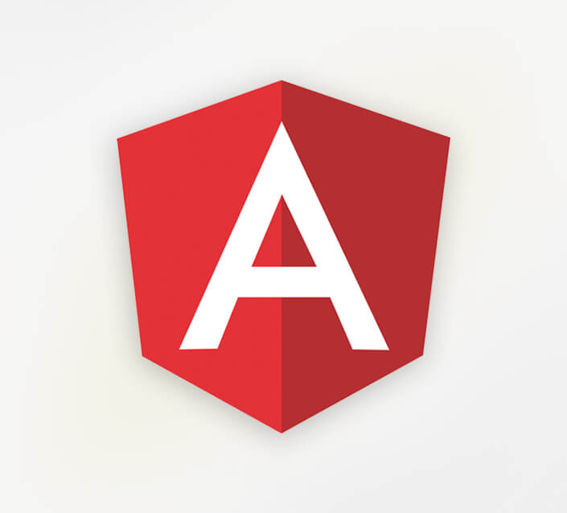
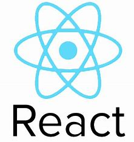
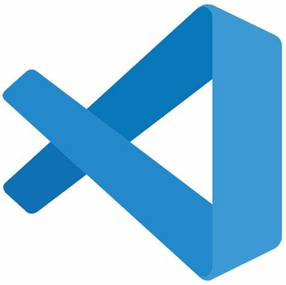

# Intro to HTML 

---

## Slide 1

# MERN(A)

- Day 2
---

## Slide 2

# MERN STACK

- The MEAN stack is a software stack
- The term stack refers to the combination of components and tools that make up the application.
- It is a set of the technology layers that make up a modern application that built entirely in JavaScript.
---

## Slide 3

# MONGO DB

- MongoDB introduced the collection and documentation of the data.
- It offers the NoSQL type database.
- A database server that is queried using JSON and that stores data structures in a binary JSON format.

---

## Slide 4

# NodeJS (back-end runtime environment)

- A JavaScript runtime environment
- Node is cross-platform, runs on both servers and clients
- We use to build server-side applications, but it does not know how to perform serving files, handling requests, and handling HTTP methods, so this is where express js comes in

---

## Slide 5

# ExpressJS (back-end web framework)

- A server-side JavaScript framework.
- Express JS is a Node.js framework designed to build API's web applications cross-platform mobile apps quickly and make node js easy.
- It's a layer built on the top of the Node js that helps manage servers and routes.

---

## Slide 6

# Angular (front-end framework)

- Client-side framework.
- Used to build the front end for a MEAN application.
- Angular by writing in TypeScript,
- Many single-page web apps are built using Angular on the front end.

---

## Slide 7

# REACT (Frontend Library)

- React is a JavaScript library created by Facebook
- It is a User Interface (UI) library
- React is a tool for building UI components

---

## Slide 8

# Computer Languages

---

## Slide 9

# Programming language

- It is a set of instructions or code which tells a computer what it needs to do.
- It is provide a logic or instruction to the computer to perform some task to get the desired output from it.
- Eg: Java, C, C++, C#
- Examples
---

## Slide 10

# Scripting Language

- Scripting languages are basically the subcategory of programming languages
- Which is used to give guidance to another program or we can say to control another program so it also involves instructions.
- It basically connects one language to one another languages and doesn’t work standalone.
- Eg: JavaScript, PHP, Perl, Python,
---

## Slide 11

# MARKUP LANGUAGE

- Markup languages prepare a structure for the data or prepare the look or design of a page.
- These are presentational languages and it does not include any kind of logic or algorithm.
- Eg:HTML, XML, XHTML etc.
---

## Slide 12

# CODE EDITOR

- A code editor is basically a text editor but it is also designed to help you write code.
- Eg: vs code editor, sublime, pycharm etc
---

## Slide 13

# Visual Studio Code

- It is a lightweight but powerful source code editor which runs on your desktop and is available for Windows, macOS and Linux.
- Download for Windows: https://code.visualstudio.com/Download
- Download for Linux: https://snapcraft.io/code

---

## Slide 14

# VS Code Extensions

- Auto close tag
- htmltagwrap
- live server
- Material icon Theme
---

## Slide 15

# HTML (Hyper Text Markup Language)

- It is the standard markup language for creating Web pages.
- It describes the structure of a Web page
- It consists of a series of elements
- It's elements tell the browser how to display the content
---

## Slide 16

# ELEMENTS

- HTML element is defined by a start tag, some content, and an end tag.
- <Starting tag> Content goes here... </Ending tag>
- Eg:  <h1>My First Heading</h1>
---

## Slide 17

# TAGS

- All HTML tags must enclosed within < > these brackets.
- If you have used an open tag <tag>, then you must use a close tag </tag> (except some tags)
- <tag> content </tag>
- eg:
 Paragraph Tag 

---

## Slide 18

# Attribute

- All HTML elements can have attributes
- Attributes provide additional information about elements
- Attributes are always specified in the start tag
- Attributes usually come in name/value pairs like: name="value“
- The <a> tag defines a hyperlink. The href attribute specifies the URL of the page .
---

## Slide 19

# UNCLOSED HTML TAG

- Some HTML tags are not closed, for example br and hr.
-   Tag: br stands for break line, it breaks the line of the code.
- 
 Tag: hr stands for Horizontal Rule. This tag is used to put a line across the webpage.
---

## Slide 20

# BASIC TAGS

- The <!DOCTYPE html> declaration defines that this document is an HTML5 document
- <html>-element is the root element of an HTML page
- The <head> element contains meta information about the HTML page
- The <title> element specifies a title for the HTML page (which is shown in the browser's title bar or in the page's tab)
- The <body> element defines the document's body, and is a container for all the visible contents, such as headings, paragraphs, images, hyperlinks, tables, lists, etc.
- The <h1> element defines a large heading
- The 
 element defines a paragraph
---

## Slide 21

# COMMENTING TAG

- The comment tag is used to insert comments in the source code.
- Comments are not displayed in the browsers.
- It enhances the readability
- <!--This is a comment. Comments are not displayed in the browser-->
- 
This is a paragraph.

---

## Slide 22

# TEXT TAGS

- Heading - <h1><h1> to <h6></h6>
- Paragraph - 

- <b> and <strong> Tags
- <i> and <em> Tags
- <pre> Tag
- <mark> Tag
- <small> Tag - <big> Tag
-  Tag
-  Tag
- <del> Tag
---

## Slide 23

# SEMANTIC TAGS

- A semantic element clearly describes its meaning to both the browser and the developer.
- Eg <form>, <header>, <table>, and <article>
---

## Slide 24

# NON-SEMANTIC TAGS

- Tells nothing about its content.
- Examples of non-semantic elements: 
 and 
---

## Slide 25

# TASK

- Difference Between HTML 4 & HTML 5
- FEATURES OF HTML 5
---

## Slide 26

# Thank You
