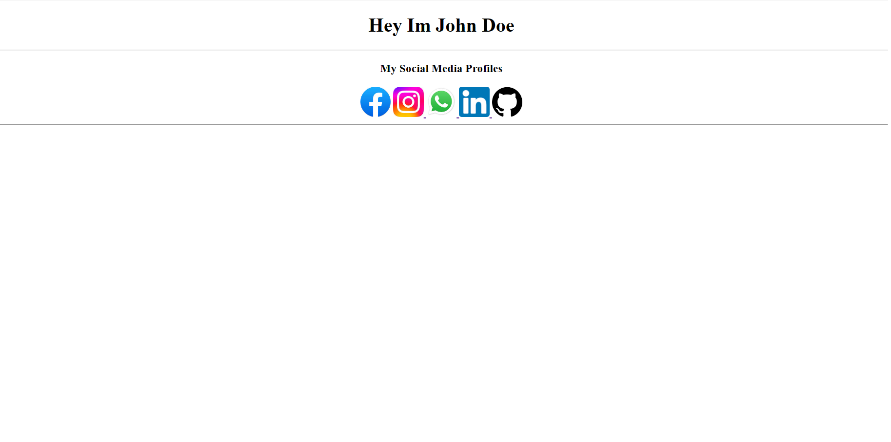

# Link and List in HTML

---

## Slide 1

# IMAGES,LINKS & LISTS

---

## Slide 2

# IMAGES

- The HTML  tag is used to embed an image in a web page.
- Images are not technically inserted into a web page; images are linked to web pages.
- The  tag is empty, it contains attributes only, and does not have a closing tag.
- The  tag has two required attributes:
- src - Specifies the path to the image
- alt - Specifies an alternate text for the image
---

## Slide 3

# Image Size - Width and Height

- We can use the width and height attributes:
- The width and height attributes always define the width and height of the image in pixels.
- 
---

## Slide 4

# Common Image Format

---

## Slide 5

# LINKS

- Links are found in nearly all web pages. Links allow users to click their way from page to page.
- HTML links are hyperlinks.
- The <a> tag defines a hyperlink
- Syntax :
- <a href="url">link text</a>
---

## Slide 6

# Links with Images

- 
- An unvisited link is underlined and blue
- A visited link is underlined and purple
- An active link is underlined and red
---

## Slide 7

# LIST

- HTML Lists are used to specify lists of information.
- All lists may contain one or more list elements.
- It allow web developers to group a set of related items in lists.
- Each list item starts with the <li> tag.
---

## Slide 8

# TYPES OF LIST

- There are three different types of HTML lists:
- Ordered List or Numbered List (ol)
- Unordered List or Bulleted List (ul)
- Description List or Definition List (dl)
---

## Slide 9

# 1. ORDERED LIST

- In the ordered HTML lists, all the list items are marked with numbers by default.
- It is known as numbered list also.
- The ordered list starts with <ol> tag and the list items start with <li> tag.
- List can be reversed also available <ol reversed>
- Eg: <ol >
- <li>Coffee</li>
- <li>Tea</li>
- <li>Milk</li>
- </ol>
---

## Slide 10

# ORDERED LIST

- There can be different types of numbered list:
- Numeric Number (1, 2, 3)
- Capital Roman Number (I II III)
- Small Romal Number (i ii iii)
- Capital Alphabet (A B C)
- Small Alphabet (a b c)
---

## Slide 11

# DIFFERENT TYPES OF ODERES

---

## Slide 12

# 2.UNORDERD LIST

- An unordered list starts with the <ul> tag.
- The list items will be marked with bullets (small black circles) by default
- Eg:
- <h1>I love these drinks...!</h1>
- <ul>
- <li>Coffee</li>
- <li>Tea</li>
- <li>Milk</li>
- </ul>
---

## Slide 13

# TYPES OF UNODERED LIST

---

## Slide 14

# 3.DEFINITION LIST/DESCRIPTION LIST

- A description list is a list of terms, with a description of each term.
- The <dl> tag defines the description list
- The <dt> tag defines the term (name)
- The <dd> tag describes each term
---

## Slide 15

- <dl>
- <dt>Coffee</dt>
- <dd>- black hot drink</dd>
- <dt>Milk</dt>
- <dd>- white cold drink</dd>
- </dl>
---

## Slide 16

# TASK 2

---

## Slide 17

# TASK 1

---

## Slide 18

- Thank You
