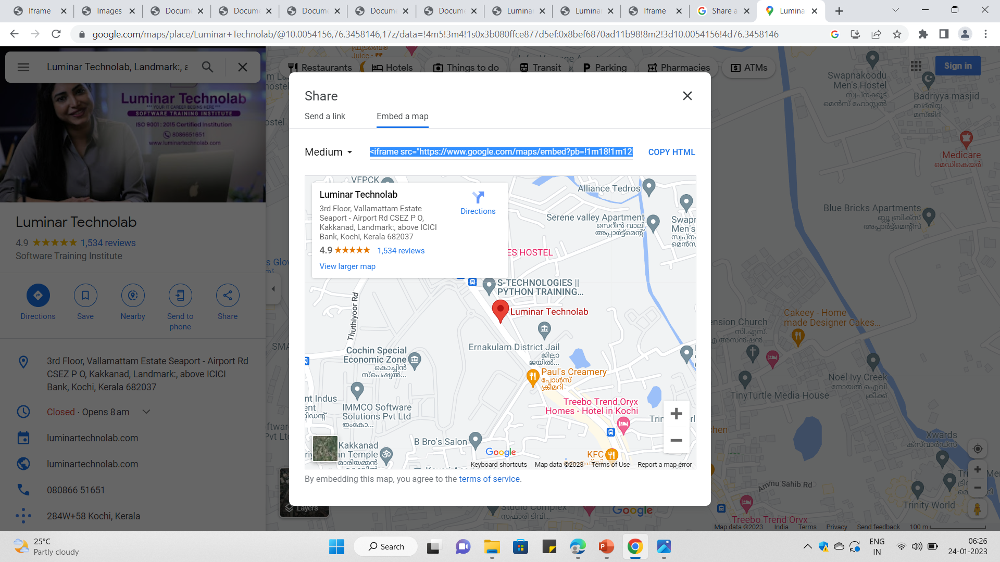
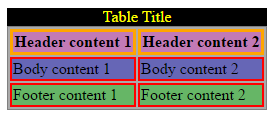

# IFRAME & TABL

---

## Slide 1

# IFRAME & TABLE

- DAY 4

### Notes

1

---

## Slide 2

# IFRAMES

- An HTML iframe is used to display a web page within a web page.
- The HTML <iframe> tag specifies an inline frame.
- An inline frame is used to embed another document within the current HTML document
- Syntax
- <iframe src="url" title="description"></iframe>
---

## Slide 3

# Set Width and Height of iframe

- To set the width and height of iframe by using "width" and "height" attributes.
- By default, the attributes values are specified in pixels but you can also set them in percent. i.e. 50%, 60% etc.
- Eg:   <iframe src="https://www.facebook.com/" style="height:300px;width:400px"></iframe>
---

## Slide 4

# Embed YouTube video using iframe

- Goto YouTube video which you want to embed.
- Click on SHARE ➦ under the video.
- Click on Embed <> option.
- Copy HTML code.
- Paste the code in your HTML file
- Change height, width, and other properties (as per requirement).
---

## Slide 5

# Embed Google map in HTML

- Open Google Maps.
- Search your location.
- Click Share Icon
- Click Embed map.
- Copy the text in the box. Paste it into the HTML of your website or blog.
---

## Slide 6

---

## Slide 7

# Iframes Tag Attribute

- Src: This attribute is used to insert a file that needs to be included in the frame. URL specifies the target webpage to be loaded within an iframe.
- Name: Name is an attribute used to give some identification name to the frame. It’s most useful where you are creating one link to open another webpage.
- allowfullscreen: This attribute allows you to display your frame in the full-width format. So we have to set the value true to happen this function.
- Frameborder: This is a helpful attribute that allows you to show a border or not to show the border to the frame. Value 1 is to show border & 0 not to show border to the frame.
---

## Slide 8

# Iframes Tag Attribute

- Marginwidth: Allows you to define space between the left & right sides of the frame
- Marginheight: This allows you to define space between the top & bottom of the frame.
- Scrolling: These attributes control whether the scrollbar will show or not to the frame. The values included are ‘yes’, ‘ no,’ or ‘auto.’
- Height: It is used to define the height of the frame. Whether in % or pixels
- Width: It is used to define the width of the frame. Wether in % or pixels
- Longdesc: With the help of this attribute, you can link another page with a lengthy description of the contents of your frame.
---

## Slide 9

# TABLE

- The table is one of the most useful constructs.
- Tables are all over the web application.
- The main use of the table is that they are used to structure the pieces of information and structure the information on the web page.
- An HTML table is a table-based page layout.
- .
---

## Slide 10

# Table tags

- The <table> tag is used to create a table.
- In HTML, a table is considered as a group of rows containing each group of cells.
- There can be many columns in a row.
- HTML tables should be used for tabular data only, but they are also used for creating layout web pages.
- If we build HTML tables without any styles or attributes in the browser, they will be displayed without any border.
- Table tag : <TABLE> </TABLE>
- The content which we write between these tags will be displayed within the table.
---

## Slide 11

# 1. <thead> Tag

- The <thead> defines a set of rows defining the head of the columns of the table.
- Syntax:
- <thead></thead>
---

## Slide 12

# 2. <tbody> Tag

- The <tbody> tag is used to group the body content in the HTML table.
- Tables can contain more than one body; in some tables, in the other case, the table can contain only one body; in those cases, the <tbody> can be removed.
- Tables with one body will have an implicit body.
- Syntax: <tbody> </tbody>
---

## Slide 13

---

## Slide 14

# 3. <tfoot> Tag

- The <tfoot> tag contains rows that represent a footer or summary.
- Syntax:
- <tfoot> </tfoot>
---

## Slide 15

# 4. <tr> Tag

- The <tr> tag is used to define a row in the HTML table.
- Starts the row with the beginning by <TR> row tag and then build the row by creating each cell, and when finish all the cells for a row, then close the row with the ending row tag </TR>.
- Row tag : <TR> </TR>
---

## Slide 16

# 5. <td> Tag

- The <td> tag is used to define the data for the cell in the HTML table.
- We will create each cell with the beginning cell tag <TD> and then add the content or data to the cell and then close the cell with the ending cell tag </TD>.
- Cell tag : <TD> </TD>
---

## Slide 17

# 6. <th> Tag

- The <th> tag is used to define the header cell in an HTML table.
- The header cell in the table is used to provide information for the remaining cells of the column.
- Header tag : <TH> </TH>
---

## Slide 18

# 7. <bgcolor> Tag

- The <bgcolor> tag is used to specify the background color of the table.
- Syntax: <table bgcolor = "color_name">
- For the color name, we can directly provide the color name for the background.
- For example <table bgcolor =”Red”>
---

## Slide 19

# 8. <caption> Tag

- The <caption> tag is used to provide the caption to the table.
- It is placed or used immediately after the <table> tag.
- By default, the table caption will be center-aligned above the table.
- Caption tag : <caption> </caption>
---

## Slide 20

# 9. Cell Spanning

- Spanning is nothing but combining two or more adjacent cells in the table.
- It consists of col span and row span.
- Col span: The col span attribute specifies the number of columns a table cell should span.
- <td col span = “number”>
- It always takes an integer value.
- Row span: The row span attribute specifies the number of rows a table cell should span.
- <td row span = “number”>
- It always takes an integer value.
---

## Slide 21

# TASK 1

---

## Slide 22

- TASK 2