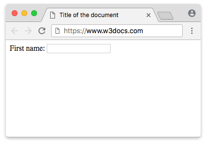

# ddb33684-3a86-4ea8-8253-8c927bff0bd5

---

## Slide 1

# Types of Elements &Form tags

- DAY 5
---

## Slide 2

# TYPES OF ELEMENTS

- INLINE ELEMENTS
- BLOCK ELEMENTS
---

## Slide 3

# 1.INLINE ELEMENTS

- An inline element does not start on a new line.
- An inline element only takes up as much width as necessary.
- Eg:
- <a>
- 
- <input>
- <i>
- <button>
- These all display in line
---

## Slide 4

# 2.BLOCK ELEMENTS

- A block-level element always starts on a new line, and the browsers
- automatically add some space (a margin) before and after the element.
- A block-level element always takes up the full width available.
- Eg:
- <h1></h1>
- 

- <footer>
- <form>
- <main>
---

## Slide 5

# FORM

- form is used to collect user input. The user input is most often sent to a server for processing.
- <form> element is used to create an HTML form for user input.
- Eg:     <form>
- <!--form elements-->
- </form>
---

## Slide 6

# FORM ELEMENTS

- <label>: It defines label for <form> elements or to display the text as label.
- <input>: It is used to get input data from the form in various types such as text, password, email, etc by changing its type.
- <button>: It defines a clickable button to control other elements or execute a functionality.
- <select>: It is used to create a drop-down list.
- <textarea>: It is used to get input long text content.
- <option>: It is used to define options in a drop-down list.
---

## Slide 7

# LABEL

- The <label> tag defines a label for many form elements.
- <lable for="">Username</label>
- Set the identifier (id) inside the <input> element and specify its name as a for attribute for the <label> tag.
- <label for="lfname">First name:</label>
- <input id="lfname" name="fname" type="text" />

---

## Slide 8

# INPUT TAG

- An <input> element can be displayed in many ways, depending on the type attribute.
- <input type="text">	Displays a single-line text input field
- <input type="radio">	Displays a radio button (for selecting one of many choices)
- <input type="checkbox">	Displays a checkbox (for selecting zero or more of many choices)
- <input type="submit">	Displays a submit button (for submitting the form)
- <input type="button">	Displays a clickable button
---

## Slide 9

# SUBMIT BUTTON

- -The <input type="submit"> defines a button for submitting the form data to a form-handler.
- <input type="submit" value="Submit">
- or
- <button type="Submit"> Login</button>
---

## Slide 10

# REGISTRATION

- <input type="button">
- <input type="checkbox">
- <input type="color">
- <input type="date">
- <input type="email">
- <input type="file">
- <input type="hidden">
- <input type="image">
- <input type="month">
- <input type="number">
- The default value of the type attribute is "text".
- <input type="radio">
- <input type="range">
- <input type="reset">
- <input type="search">
- <input type="submit">
- <input type="text">
- <input type="time">
- <input type="url">
- <input type="week">
- <input type="password">
---

## Slide 11

# TASK

---

## Slide 12

- Task 2
---

## Slide 13
